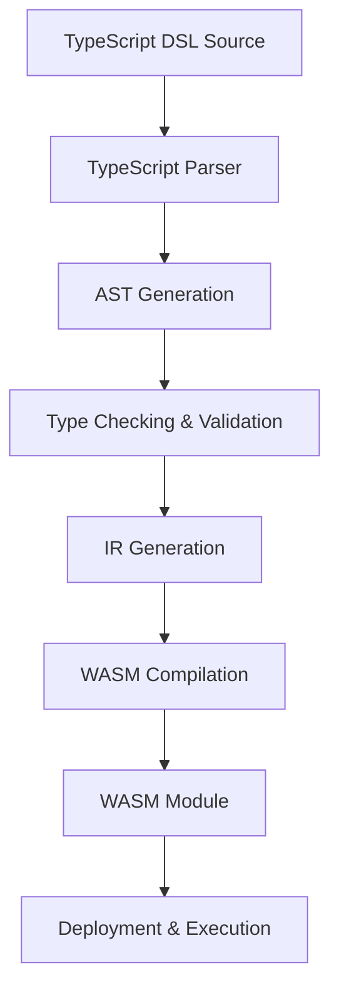

# AtlasLang TypeScript DSL Architecture Design

## 1. Overview

AtlasLang is a TypeScript-based Domain-Specific Language designed for building ethical, auditable, and regenerative systems. It serves as the official language of Atlas Sanctum, providing primitives for:

- **Covenant contracts** - Multi-signer, ethical agreements
- **Steward identities** - Role-based, MPC-controlled actors with attestations
- **MRV workflows** - Monitoring, reporting, and verification
- **AI governance** - Model provenance, risk registers, and explainability
- **Regenerative finance** - Impact-linked assets and credits
- **Privacy by design** - Consent, sealed, enclave, and ephemeral data primitives

### Architecture Goals

- **Developer Accessibility** - Familiar TypeScript syntax with domain-specific primitives
- **Security & Auditability** - Built-in provenance tracking and verification mechanisms
- **Interoperability** - Compiles to WebAssembly for portability
- **Maintainability** - Clear type system and validation rules
- **Extensibility** - Support for custom primitives and workflows

## 2. Core DSL Syntax and Structures

### 2.1 Steward Identities

Stewards represent autonomous actors with verifiable identities and attestations.

```typescript
import { steward, StewardConfig } from '@atlaslang/dsl';

export const LocalCouncil = steward<StewardConfig>({
  id: "did:ke:lc:001",
  name: "Local Water Council",
  attestations: ["council-auth", "water-quality-expert"],
  thresholds: {
    decision: 0.6, // 60% agreement required
    emergency: 0.8 // 80% agreement for emergencies
  }
});

export const AtlasCouncil = steward<StewardConfig>({
  id: "did:atlas:council:001",
  name: "Atlas Global Council",
  attestations: ["global-governance"],
  thresholds: {
    decision: 0.5,
    emergency: 0.75
  }
});
```

### 2.2 Covenant Contracts

Covenants are multi-party agreements with governance rules and state transitions.

```typescript
import { covenant, Covenant, Steward } from '@atlaslang/dsl';
import { LocalCouncil, AtlasCouncil } from './stewards';

interface RepairRequest {
  id: string;
  community: string;
  image_hash: string;
  location: { lat: number; lng: number };
  timestamp: Date;
}

export const BoreholeCovenant = covenant<Covenant<[typeof LocalCouncil, typeof AtlasCouncil]>>({
  name: "Borehole Water Credit Covenant",
  purpose: "Verified borehole repairs create WaterCredits",
  stewards: [LocalCouncil, AtlasCouncil],
  models: {
    photoVerifier: {
      id: "model:atlas:photo-verifier:v1",
      version: "1.0.0"
    }
  },
  guards: {
    pre: {
      disburse_repair: (request: RepairRequest) => {
        return model.photoVerifier.run(request.image_hash) === true;
      }
    },
    post: {
      disburse_repair: (request: RepairRequest, credit: any) => {
        return credit.holder === request.community;
      }
    }
  },
  actions: {
    disburse_repair: (request: RepairRequest) => {
      const credit = covenant_token.mint({
        holder: request.community,
        amount: 100,
        purpose: "Borehole repair completion"
      });
      
      ledger.append("water_credit", credit.provenance());
      return credit;
    }
  },
  sanctions: {
    invalid_verification: (steward: Steward) => {
      return {
        type: "suspension",
        duration: "30d",
        reason: "Invalid photo verification"
      };
    }
  }
});
```

### 2.3 Model Governance

Models are first-class citizens with provenance, risk registers, and explainability hooks.

```typescript
import { model, ModelConfig } from '@atlaslang/dsl';

export const PhotoVerifier = model<ModelConfig>({
  id: "model:atlas:photo-verifier:v1",
  version: "1.0.0",
  name: "Water Point Photo Verifier",
  provider: "AtlasAI",
  purpose: "Verifies borehole repair completion from photos",
  risk_register: {
    accuracy: 0.95,
    fairness: 0.88,
    explainability: "LIME",
    privacy: "differential-privacy"
  },
  provenance: {
    training_data: ["did:data:water-points:2023"],
    training_method: "transfer-learning",
    audit_report: "audit:2023-11-15:atlas-photo-verifier"
  },
  explainability_hooks: {
    feature_importance: true,
    counterfactual_explanations: true
  }
});
```

### 2.4 Regenerative Finance Primitives

```typescript
import { covenant_token, TokenConfig } from '@atlaslang/dsl';

export const WaterCredit = covenant_token<TokenConfig>({
  name: "WaterCredit",
  symbol: "WC",
  decimals: 0,
  purpose: "Reward for verified water access improvements",
  redemption: {
    method: "carbon-offset",
    conversion_rate: "1 WC = 0.1 tCO2",
    expiry: "never"
  },
  impact_metrics: {
    water_access: true,
    health_impact: true,
    climate_impact: false
  },
  governance: {
    minting: "multi-sig",
    burning: "automated",
    redistribution: "community-vote"
  }
});
```

### 2.5 MRV Workflows

```typescript
import { sanctum_flow, FlowConfig } from '@atlaslang/dsl';

export const BoreholeMRV = sanctum_flow<FlowConfig>({
  id: "flow:mrv:borehole-repair:v1",
  name: "Borehole Repair MRV",
  steps: [
    {
      name: "Request Submission",
      actor: "Community",
      fields: ["id", "community", "location", "image_hash", "timestamp"],
      validation: "community-attestation"
    },
    {
      name: "Photo Verification",
      actor: "AI Model",
      model: "model:atlas:photo-verifier:v1",
      validation: "model-confidence"
    },
    {
      name: "Council Approval",
      actor: "Steward",
      stewards: [LocalCouncil],
      validation: "majority-vote"
    },
    {
      name: "Credit Issuance",
      actor: "Smart Contract",
      action: "disburse_repair",
      validation: "auto-execution"
    }
  ],
  verification_period: "24h",
  dispute_window: "7d",
  audit_frequency: "quarterly"
});
```

## 3. Type System and Validation Rules

### 3.1 Type Hierarchy

```typescript
// Base types
type Address = string; // DID format: did:<method>:<network>:<identifier>
type Attestation = string; // Attestation type or credential ID
type ModelID = string; // model:<namespace>:<name>:<version>
type TokenAmount = number;

// Core primitives
type Steward = {
  id: Address;
  name: string;
  attestations: Attestation[];
  thresholds: { [key: string]: number };
};

type Model = {
  id: ModelID;
  version: string;
  name: string;
  provider: string;
  purpose: string;
  risk_register: RiskRegister;
  provenance: ModelProvenance;
  explainability_hooks: ExplainabilityHooks;
};

type CovenantToken = {
  name: string;
  symbol: string;
  decimals: number;
  purpose: string;
  redemption: RedemptionConfig;
  impact_metrics: { [key: string]: boolean };
  governance: TokenGovernance;
};

// Risk and governance types
type RiskRegister = {
  accuracy: number;
  fairness: number;
  explainability: string;
  privacy: string;
};

type ModelProvenance = {
  training_data: string[];
  training_method: string;
  audit_report: string;
};

type ExplainabilityHooks = {
  feature_importance: boolean;
  counterfactual_explanations: boolean;
};

type RedemptionConfig = {
  method: string;
  conversion_rate: string;
  expiry: string;
};

type TokenGovernance = {
  minting: string;
  burning: string;
  redistribution: string;
};
```

### 3.2 Validation Rules

1. **Steward Validation**:
   - Must have a valid DID format
   - Attestations must be registered credential types
   - Thresholds must be between 0 and 1
   - At least one steward must be defined per covenant

2. **Covenant Validation**:
   - Must have a clear purpose
   - Must specify participating stewards
   - Guards must be pure functions (no side effects)
   - Actions must be deterministic
   - Sanctions must be proportional and clearly defined

3. **Model Validation**:
   - Must have a valid model ID format
   - Risk register values must be between 0 and 1
   - Provenance must include training data sources
   - Explainability hooks must be explicitly enabled/disabled

4. **Token Validation**:
   - Must have unique name and symbol
   - Decimals must be between 0 and 18
   - Purpose must clearly state the token's impact focus
   - Redemption methods must be valid and auditable

5. **Flow Validation**:
   - Must have at least one step
   - Each step must specify an actor and validation method
   - Steps must form a directed acyclic graph (DAG)
   - Verification and dispute windows must be positive durations

## 4. AST Structure

### 4.1 Root Level

```typescript
interface AtlasLangProgram {
  type: 'Program';
  declarations: (StewardDeclaration | CovenantDeclaration | ModelDeclaration | TokenDeclaration | FlowDeclaration)[];
  imports: ImportStatement[];
}
```

### 4.2 Declarations

```typescript
interface StewardDeclaration {
  type: 'StewardDeclaration';
  identifier: string;
  config: StewardConfig;
  sourceLocation: SourceLocation;
}

interface CovenantDeclaration {
  type: 'CovenantDeclaration';
  identifier: string;
  config: CovenantConfig;
  sourceLocation: SourceLocation;
}

interface ModelDeclaration {
  type: 'ModelDeclaration';
  identifier: string;
  config: ModelConfig;
  sourceLocation: SourceLocation;
}

interface TokenDeclaration {
  type: 'TokenDeclaration';
  identifier: string;
  config: TokenConfig;
  sourceLocation: SourceLocation;
}

interface FlowDeclaration {
  type: 'FlowDeclaration';
  identifier: string;
  config: FlowConfig;
  sourceLocation: SourceLocation;
}
```

### 4.3 Statements and Expressions

```typescript
interface ImportStatement {
  type: 'ImportStatement';
  moduleSpecifier: string;
  importedNames: string[];
  sourceLocation: SourceLocation;
}

interface FunctionDefinition {
  type: 'FunctionDefinition';
  name: string;
  parameters: Parameter[];
  body: Expression;
  sourceLocation: SourceLocation;
}

interface Parameter {
  type: 'Parameter';
  name: string;
  typeAnnotation: TypeAnnotation;
  sourceLocation: SourceLocation;
}

interface Expression {
  type: 'Expression';
  kind: 'Binary' | 'Unary' | 'Call' | 'Identifier' | 'Literal';
  // ... specific properties based on kind
}

interface TypeAnnotation {
  type: 'TypeAnnotation';
  kind: 'Primitive' | 'Array' | 'Object' | 'Union' | 'Intersection';
  // ... specific properties based on kind
}

interface SourceLocation {
  file: string;
  line: number;
  column: number;
}
```

### 4.4 Covenant-Specific Nodes

```typescript
interface GuardDefinition {
  type: 'GuardDefinition';
  phase: 'pre' | 'post';
  action: string;
  condition: Expression;
  sourceLocation: SourceLocation;
}

interface ActionDefinition {
  type: 'ActionDefinition';
  name: string;
  parameters: Parameter[];
  body: Expression;
  sourceLocation: SourceLocation;
}

interface SanctionDefinition {
  type: 'SanctionDefinition';
  name: string;
  condition: Expression;
  penalty: Expression;
  sourceLocation: SourceLocation;
}
```

### 4.5 Flow-Specific Nodes

```typescript
interface FlowStep {
  type: 'FlowStep';
  name: string;
  actor: 'Community' | 'AI Model' | 'Steward' | 'Smart Contract';
  fields?: string[];
  model?: string;
  stewards?: string[];
  action?: string;
  validation: string;
  sourceLocation: SourceLocation;
}
```

## 5. Compilation Pipeline

### 5.1 Overview



### 5.2 Detailed Pipeline Steps

#### Step 1: TypeScript Parser

- Parse TypeScript DSL source code using TypeScript compiler API
- Convert TypeScript AST to AtlasLang-specific AST
- Validate basic syntax and structure

#### Step 2: AST Generation

- Create AtlasLang-specific AST nodes
- Resolve imports and declarations
- Build symbol table for type checking

#### Step 3: Type Checking & Validation

- Perform semantic validation
- Check type annotations against TypeScript type system
- Validate DSL-specific constraints (DID formats, thresholds, etc.)
- Report errors with source locations

#### Step 4: Intermediate Representation (IR) Generation

- Compile validated AST to an intermediate representation (IR)
- Optimize for WebAssembly
- Add provenance metadata
- Generate verification artifacts

#### Step 5: WASM Compilation

- Compile IR to WebAssembly using Binaryen
- Generate compact, efficient modules
- Optimize for low resource usage

#### Step 6: Output Generation

- Produce WASM modules for execution
- Generate metadata files for provenance tracking
- Create audit reports and verification artifacts

### 5.3 Tools and Dependencies

- **TypeScript Compiler API** - Parsing and type checking
- **Binaryen** - WebAssembly compilation
- **WABT** - WebAssembly binary tools
- **Zod** - Validation schema definition
- **Linting/Formatting** - ESLint + Prettier

## 6. Architecture Components

### 6.1 DSL Runtime

```typescript
// Runtime interfaces exposed to compiled code
interface AtlasLangRuntime {
  // Steward operations
  getSteward(id: string): Steward;
  getAttestations(id: string): Attestation[];
  checkThreshold(stewards: string[], action: string, votes: number): boolean;
  
  // Covenant operations
  executeGuard(guard: string, context: any): boolean;
  executeAction(action: string, context: any): any;
  applySanction(steward: string, sanction: string): void;
  
  // Model operations
  runModel(modelId: string, input: any): any;
  getModelProvenance(modelId: string): ModelProvenance;
  getModelRisk(modelId: string): RiskRegister;
  
  // Token operations
  mintToken(tokenId: string, params: any): any;
  burnToken(tokenId: string, amount: number): void;
  transferToken(tokenId: string, from: string, to: string, amount: number): void;
  
  // Ledger operations
  appendLedger(entryType: string, data: any): string;
  getLedgerEntry(id: string): any;
  verifyProvenance(entryId: string): boolean;
  
  // Flow operations
  executeFlowStep(step: string, context: any): any;
  verifyFlowCompletion(flowId: string, context: any): boolean;
}
```

### 6.2 Compiler Architecture

```typescript
// Compiler entry point
class AtlasLangCompiler {
  static compile(source: string, options?: CompilerOptions): CompilationResult;
}

interface CompilerOptions {
  target: 'wasm32-unknown-unknown' | 'wasm32-wasi';
  optimize: 'none' | 'speed' | 'size' | 'balanced';
  metadata: boolean;
  auditReport: boolean;
}

interface CompilationResult {
  wasmModule: Uint8Array;
  metadata: any;
  auditReport: AuditReport;
  errors: CompilationError[];
}

interface AuditReport {
  version: string;
  compileDate: Date;
  dependencies: string[];
  validationResults: ValidationResult[];
}

interface CompilationError {
  message: string;
  file: string;
  line: number;
  column: number;
  severity: 'error' | 'warning' | 'info';
}
```

### 6.3 Development Tools

- **VSCode Extension** - Syntax highlighting, auto-completion, validation
- **CLI Tool** - Compilation, validation, and deployment commands
- **Debugger** - Step-through debugging for AtlasLang programs
- **Testing Framework** - Unit and integration testing support

## 7. Design Decisions

### 7.1 TypeScript-Based DSL

**Decision**: Use TypeScript syntax with domain-specific primitives

**Rationale**:
- Lower learning curve for developers already familiar with TypeScript
- Existing TypeScript tooling support (IDEs, linters, formatters)
- Type safety and static analysis capabilities
- Large ecosystem of libraries and resources

**Tradeoffs**:
- Adds TypeScript compilation overhead
- Requires careful type system design to prevent abuse
- May be less "pure" than a custom syntax

### 7.2 Compilation Target

**Decision**: Compile to WebAssembly (WASM)

**Rationale**:
- Portability across platforms (blockchains, browsers, cloud, edge)
- Security sandboxing capabilities
- Performance comparable to native code
- Small module sizes for distribution

**Tradeoffs**:
- Requires WASM runtime support
- Debugging complexity
- Limited direct access to system resources

### 7.3 Governance Model

**Decision**: Multi-steward governance with configurable thresholds

**Rationale**:
- Reflects real-world decision-making processes
- Supports democratic and weighted voting systems
- Enables flexible governance structures
- Aligns with the "covenant-first" philosophy

**Tradeoffs**:
- Complexity in threshold management
- Potential for decision paralysis
- Need for dispute resolution mechanisms

### 7.4 Privacy & Security

**Decision**: Privacy by design with sealed data and enclaves

**Rationale**:
- Addresses compliance requirements (GDPR, etc.)
- Protects sensitive community data
- Enables secure multi-party computation
- Supports transparency through verification

**Tradeoffs**:
- Performance overhead for encrypted operations
- Complexity in key management
- Need for trusted execution environments

### 7.5 Modularity

**Decision**: Component-based architecture with explicit dependencies

**Rationale**:
- Enables code reuse and composability
- Simplifies testing and maintenance
- Supports incremental development
- Improves auditability through isolation

**Tradeoffs**:
- Requires careful dependency management
- Potential for circular dependencies
- Complexity in module resolution

## 8. Future Work

### 8.1 Phase 1 - Initial Implementation

- [ ] Core DSL syntax and type system
- [ ] AST generation and validation
- [ ] Compilation to WebAssembly
- [ ] Basic runtime interface
- [ ] Command-line tooling

### 8.2 Phase 2 - Advanced Features

- [ ] Model risk assessment and mitigation
- [ ] Real-time monitoring and reporting
- [ ] Cross-chain interoperability
- [ ] Advanced privacy features (zero-knowledge proofs)
- [ ] Formal verification support

### 8.3 Phase 3 - Ecosystem

- [ ] VSCode extension with advanced features
- [ ] Testing and debugging tools
- [ ] Deployment and orchestration tools
- [ ] Community governance framework
- [ ] Integration with existing platforms

## 9. References

- [TypeScript Compiler API](https://github.com/microsoft/TypeScript/wiki/Using-the-Compiler-API)
- [WebAssembly Specification](https://webassembly.github.io/spec/)
- [Binaryen Compiler Infrastructure](https://github.com/WebAssembly/binaryen)
- [Zod Validation Library](https://github.com/colinhacks/zod)
- [Verifiable Credentials](https://www.w3.org/TR/vc-data-model/)

---

*This document outlines the initial design of the AtlasLang TypeScript DSL architecture. It will be updated as the project progresses and requirements evolve.*
